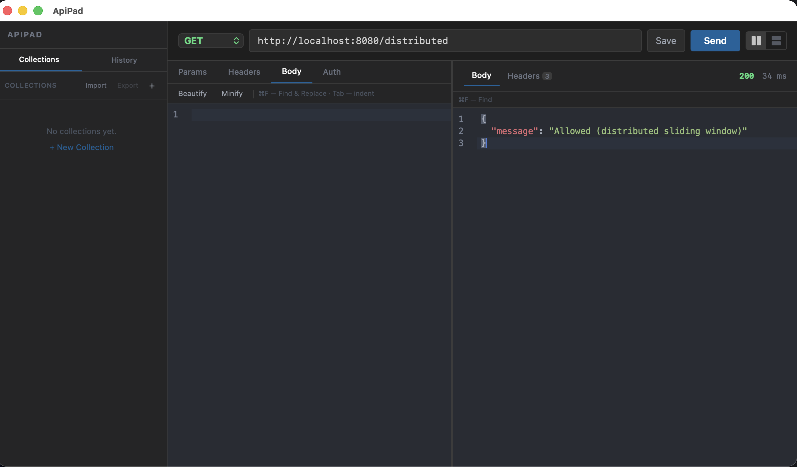
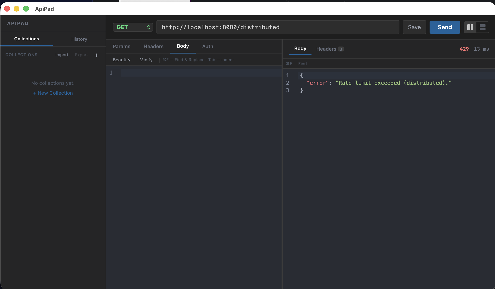

# Rate Limiter

A rate limiter implementation from scratch in Python — no external libraries used.

Built as part of a series of open-source system design projects.

## Algorithms Implemented

### 1. Sliding Window (Local)
Tracks exact timestamps of requests per user in a circular buffer. Blocks requests if count exceeds the limit within the time window.

- Accurate request counting
- Higher memory usage (stores every timestamp)
- Best for: payment gateways, strict API quotas

### 2. Token Bucket (Local)
Each user gets a bucket of tokens. Tokens refill at a fixed rate. Each request consumes one token.

- Allows bursting (multiple requests at once if tokens available)
- Low memory usage (stores only 2 values per user)
- Best for: public APIs, Nginx, GitHub, Twitter

### 3. Distributed Sliding Window (Redis-backed)

Uses Redis Lists to track request timestamps across multiple servers. Each client gets its own key (`rate:{client_id}`), timestamps are pushed and filtered by window size. A background cleanup thread periodically trims expired entries using LTRIM.

- Shared state across multiple app servers
- Background thread for lazy cleanup (no list bloat)
- Best for: distributed systems, microservices, multi-instance deployments

### 4. Distributed Token Bucket (Redis-backed)

Stores per-user token count and last refill time in Redis. On each request, calculates elapsed time, refills tokens proportionally, and checks availability.

- Allows bursting across distributed servers
- Only 2 Redis keys per user (lightweight)
- Best for: distributed APIs, shared rate limiting across instances

## Data Structures (built from scratch)

- **HashMap** — array of buckets, hash function with chaining for collision handling
- **CircularBuffer** — fixed-size buffer with head/tail pointers and wrap-around

## Redis Integration (Mini Redis)

This project uses [mini-redis](https://github.com/NiHaLOO7/mini-redis) — a Redis implementation built from scratch as part of the same project series.

### Why Redis?

Local rate limiters (sliding window, token bucket) only work on a single server. If your app runs on multiple instances behind a load balancer, each instance has its own counter — a user can bypass limits by hitting different servers.

Redis solves this by providing a **shared state** across all instances:

```
User → Load Balancer → Server 1 ─┐
                     → Server 2 ─┼──→ Redis (shared counters)
                     → Server 3 ─┘
```

All servers read/write from the same Redis — rate limits are enforced globally.

### Redis Commands Used

- **SET / GET** — store and retrieve token counts, timestamps
- **LPUSH** — push request timestamp to a list
- **LRANGE** — get all timestamps in a window
- **LTRIM** — trim old entries (background cleanup)

## How to Run

### Local (no Redis needed)

```bash
python3 demo.py
```

Endpoints:
```
http://localhost:8080/local/sliding?a=10&b=3&op=-
http://localhost:8080/local/bucket?a=10&b=3&op=*
```

### Distributed (requires mini-redis)

1. Start mini-redis (Docker):
```bash
cd ~/Desktop/Codes/GIT_PROJ/mini-redis
docker compose up --build
```

2. Run rate limiter demo:
```bash
cd ~/Desktop/Codes/GIT_PROJ/rate-limiter
python3 demo.py
```

3. Test distributed endpoints:
```bash
http://localhost:8080/distributed/sliding?a=10&b=3&op=-
http://localhost:8080/distributed/bucket?a=10&b=3&op=*
```

### Rate Limits (demo defaults)

| Endpoint | Limit |
|----------|-------|
| `/local/sliding` | 5 requests per 10 seconds |
| `/local/bucket` | 5 tokens, refills 5/min |
| `/distributed/sliding` | 5 requests per 10 seconds |
| `/distributed/bucket` | 5 tokens, refills 1/sec |

All endpoints return `429 Rate limit exceeded` when blocked.

## Usage

```python
from src.rate_limiter import SlidingWindowRateLimiter, TokenBucketRateLimiter
from src.distributed_sliding_window import DistributedSlidingWindowRateLimiter
from src.distributed_token_bucket import DistributedTokenBucketRateLimiter

# Local
limiter = SlidingWindowRateLimiter(max_requests=5, window_seconds=60)
limiter.is_allowed("user1", current_time)  # True / False

limiter = TokenBucketRateLimiter(capacity=10, refill_rate=1)
limiter.is_allowed("user1", current_time)  # True / False

# Distributed (connects to mini-redis automatically via config)
limiter = DistributedSlidingWindowRateLimiter(max_requests=5, window_seconds=10)
limiter.is_allowed("user1")  # True / False

limiter = DistributedTokenBucketRateLimiter(capacity=5, refill_rate=1)
limiter.is_allowed("user1")  # True / False
```

## Run Tests

```bash
python3 -m unittest tests.test -v
```

## Project Structure

```
rate-limiter/
├── src/
│   ├── hash_map.py                    # HashMap implementation
│   ├── circular_buffer.py             # CircularBuffer implementation
│   ├── rate_limiter.py                # SlidingWindowRateLimiter, TokenBucketRateLimiter
│   ├── distributed_sliding_window.py  # Redis-backed sliding window + cleanup thread
│   ├── distributed_token_bucket.py    # Redis-backed token bucket
│   ├── redis_client.py                # TCP client for mini-redis
│   └── config.py                      # Redis connection config
├── tests/
│   └── test.py                        # Unit tests
├── assets/
│   ├── demo.png                       # Demo screenshot (local)
│   └── demo2.png                      # Demo screenshot (distributed 429)
├── demo.py                            # HTTP server demo (calculator API with rate limiting)
└── requirements.txt
```

### Demo Screenshot



### Distributed Rate Limiting Demo



> Tested with [ApiPad](https://github.com/NiHaLOO7/ApiPad) — an open-source, lightweight API client. Simple, fast, no sign-up required, and always free. Built as a Postman alternative. Contributions welcome!
